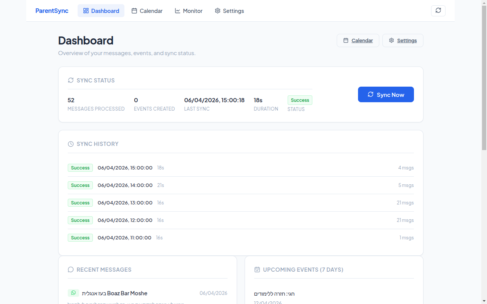
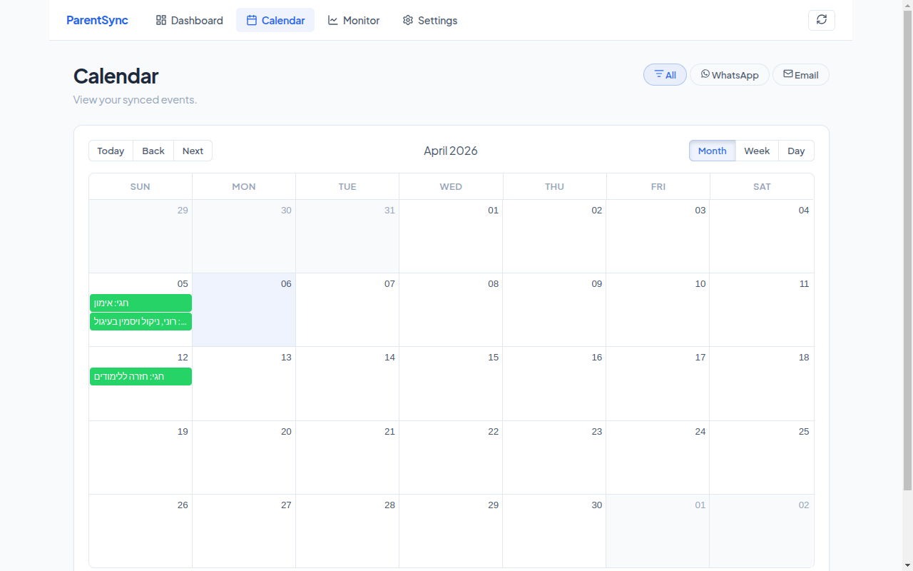
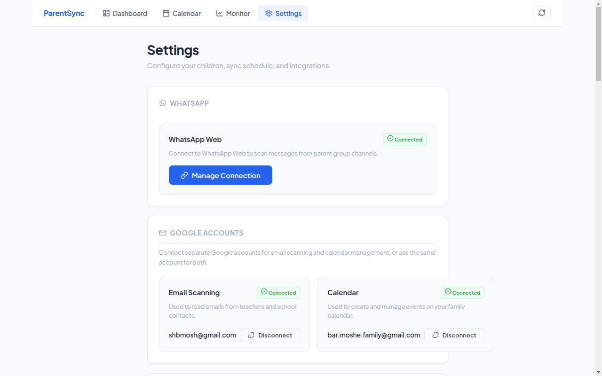

# ParentSync

> A cross-platform desktop app that watches your WhatsApp parent groups and Gmail, uses an LLM to pull out the actual events (field trips, deadlines, doctor visits), routes each one through a WhatsApp approval channel, and syncs the survivors to a family Google Calendar.

[](https://claude.com/claude-code)
[](https://shaharbarmoshe.github.io/ParentSync/)


📊 **[View the interactive presentation →](https://shaharbarmoshe.github.io/ParentSync/presentation.html)** · [PDF](https://shaharbarmoshe.github.io/ParentSync/ParentSync-Presentation.pdf) · [Docs site](https://shaharbarmoshe.github.io/ParentSync/)

| Dashboard | Calendar | Settings |
|---|---|---|
|  |  |  |

---

## Why This Project

Two parents, four WhatsApp class groups, two school inboxes, one shared calendar — and somehow always one missed permission slip. ParentSync is the system that reads everything, decides what's actually an event, asks you before publishing, and keeps the family calendar honest.

It's also a deliberately end-to-end engineering exercise: a real Electron app with a real backend, real OAuth, real LLM cost controls, and a real test pyramid — built to be readable from the top down.

## Highlights

- **End-to-end Electron desktop app** — single AppImage / `.exe` / `.dmg`. Backend, frontend, and Chromium are all packaged together; SQLite lives in the OS user-data directory.
- **Clean Architecture + Hexagonal (Ports & Adapters)** on NestJS. Every external dependency (Gmail, Google Calendar, the LLM, WhatsApp) sits behind an injection token with a swappable mock adapter.
- **LLM-driven extraction with cost controls** — batched parsing, prompt-engineered for Hebrew + English, structured output validated by class-validator DTOs. Gemini by default; OpenRouter swap-in supported.
- **Cancellation & delay detection** — the parser doesn't just create events; it recognizes "המפגש בוטל" / "נדחה ל-…" and updates or removes the existing calendar entry. ([docs](docs/EVENT-DISMISSAL.md))
- **You're in control of the AI** — two complementary ways to steer extraction: (a) **edit the system prompt** directly in Settings (textarea, Reset-to-default escape hatch), and (b) **react to suggestions** — 👍 to publish, 😢 to drop and capture the source as a *learned exclusion* the LLM sees on every parse. Reactions are reversible (take back a 👍 → unsync from Google; take back a 😢 → drop the exclusion). Both paths land in the same LLM call; changes take effect on the next sync. ([docs](docs/PROMPT-CUSTOMIZATION.md))
- **WhatsApp approval channel + in-app approval** — every extracted event is posted to a dedicated chat with an ICS attachment, *and* shown on the Dashboard with inline Approve / Reject buttons. ([docs](docs/USER-GUIDE.md))
- **LLM-based duplicate suppression** — before posting an approval message, the backend asks the LLM whether a candidate event matches an existing one at the same date+time. Catches "same gathering, different framing" — cases exact-match dedup misses.
- **OAuth 2.0 done properly** — PKCE, CSRF state, encrypted token storage at rest, refresh-on-expiry. ([writeup](docs/ARCHITECTURE.md))
- **80%+ test coverage** — unit tests via NestJS `Test.createTestingModule()`, Supertest e2e, Vitest on the frontend, real Puppeteer browser tests for the desktop UI.
- **Built with [Claude Code](https://claude.com/claude-code)** — this repo is also a case study in agentic development: see the phased implementation plan under [`plan/`](plan/) and the reusable skills/rules in [`.agents/skills/`](.agents/skills/).

## Architecture at a glance

```
┌──────────────────────────────  Electron main  ──────────────────────────────┐
│                                                                              │
│   ┌──────────── React (Vite) ────────────┐    ┌──────── NestJS ──────────┐   │
│   │  Dashboard · Calendar · Settings ·   │ ←→ │  Settings · Messages ·   │   │
│   │  Monitor · WhatsApp QR · OAuth flow  │    │  Calendar · LLM · Sync · │   │
│   └──────────────────────────────────────┘    │  Auth · Monitor          │   │
│                                                └────┬────────────┬────────┘   │
│                                                     │            │            │
│                                          ┌──────────┴──┐   ┌────┴─────────┐  │
│                                          │  TypeORM /  │   │  Ports &     │  │
│                                          │  SQLite     │   │  Adapters    │  │
│                                          └─────────────┘   └──┬───────────┘  │
└─────────────────────────────────────────────────────────────────│────────────┘
                                                                  │
                       ┌──────────────────────────────────────────┼──────────┐
                       ▼                  ▼                       ▼          ▼
                  Gmail API       Google Calendar API       OpenRouter   WhatsApp Web
                                                              (LLM)     (whatsapp-web.js)
```

Each NestJS feature module owns its domain (entities, repositories, services, controllers). External services are accessed only through interfaces — `IGmailService`, `IGoogleCalendarService`, `ILLMService`, `IMessageRepository`, `ISettingsRepository` — wired via DI tokens, so tests swap in mocks with `Test.createTestingModule().overrideProvider()`.

Full writeup: **[`docs/ARCHITECTURE.md`](docs/ARCHITECTURE.md)**.

## Tech Stack

| Layer | Choice |
|---|---|
| Desktop shell | Electron 35, electron-builder (NSIS / DMG / AppImage + deb) |
| Frontend | React 19 + TypeScript + Vite, SCSS (7-1 architecture) |
| Backend | NestJS 10 + TypeScript, class-validator, `@nestjs/config` (Joi) |
| Persistence | SQLite via TypeORM, stored in OS user-data dir |
| AI | OpenRouter (model-agnostic), prompt-engineered extraction with structured DTOs |
| WhatsApp | `whatsapp-web.js` with in-app QR onboarding, persisted session |
| Email & Calendar | Gmail API & Google Calendar API (OAuth 2.0 + PKCE) |
| Testing | Jest, Supertest, Vitest, Puppeteer |

## Documentation

| Doc | What's inside |
|---|---|
| [Architecture](docs/ARCHITECTURE.md) | Module boundaries, ports & adapters, sync orchestration |
| [User Guide](docs/USER-GUIDE.md) | What the app actually does, end-user perspective |
| [Onboarding](docs/ONBOARDING.md) | First-run flow: OAuth, WhatsApp QR, settings |
| [Prompt Customization](docs/PROMPT-CUSTOMIZATION.md) | Editing the LLM prompt, the 😢-feedback loop, cache behavior |
| [Event Dismissal](docs/EVENT-DISMISSAL.md) | Cancel / delay detection design |
| [Event Reminders](docs/EVENT-REMINDERS.md) | The 24h-before-event reminder pipeline |
| [Google Tasks](docs/GOOGLE-TASKS.md) | Timed events vs. date-only tasks |
| [Implementation plan](plan/README.md) | The phased plan that drove development |

## Getting Started

> Single-user app — no app-level auth, no dev/prod split. Built once, runs as a standalone executable.

### Prerequisites
- Node.js 18+
- npm
- Google Chrome (used by `whatsapp-web.js`)

### Setup

```bash
./setup.sh   # idempotent: deps + .env scaffold + build
```

You'll then need:

| What | How |
|---|---|
| **OpenRouter API key** (required for parsing) | Settings UI → `openrouter_api_key` ([get one](https://openrouter.ai/keys)) |
| **Google OAuth client** (Gmail + Calendar) | Settings UI → `google_client_id` / `google_client_secret` ([Cloud Console](https://console.cloud.google.com/apis/credentials)) |

### Run

```bash
# Hot-reload dev (Electron + Vite + Nest)
npm run electron:dev

# Or browser-only dev
cd backend  && npm run start:dev   # → :41932
cd frontend && npm run dev         # → :5173

# Package
npm run package:linux    # AppImage + .deb
npm run package:win      # NSIS .exe
npm run package:mac      # .dmg
```

### Test

```bash
npm test                      # backend unit + e2e + frontend
cd backend  && npm test       # backend unit tests
cd backend  && npm run test:e2e
cd frontend && npm test       # vitest
```

## Project Layout

```
parentsync/
├── electron/         Electron main process (window, tray, backend embedding)
├── backend/          NestJS API — feature modules (settings, messages,
│                     calendar, llm, sync, auth, monitor, shared)
├── frontend/         React + Vite UI (pages, components, services)
├── assets/           App icons (.ico / .icns / .png)
├── docs/             Architecture, user guide, feature designs, screenshots
├── plan/             Phased implementation plan (used to drive Claude Code)
├── scripts/          Packaging, tests, install-as-systemd-service
└── .agents/skills/   Reusable Claude Code skills (NestJS rules, OAuth2,
                      Clean Architecture, SCSS, UI/UX) used during development
```

## About Claude Code

This project was built end-to-end with **[Claude Code](https://claude.com/claude-code)**, Anthropic's coding agent. The repo intentionally preserves the artifacts of that workflow:

- **[`plan/`](plan/)** — phased implementation plan with explicit acceptance criteria, used as the source of truth Claude worked against.
- **[`.agents/skills/`](.agents/skills/)** — distilled, reusable rule sets (NestJS best practices, OAuth 2.0, Clean Architecture, SCSS, UI/UX) the agent loaded on demand.
- **[`CLAUDE.md`](CLAUDE.md)** — project-level guidance the agent reads on every session.

The result is production-quality code with explicit architectural intent, full test coverage, and human-readable docs — the engineering decisions are the human's; the typing was the agent's.

## License

Private use. Not currently published under an open-source license.

---

**Author:** Shahar Bar-Moshe · [GitHub](https://github.com/ShaharBarMoshe)
